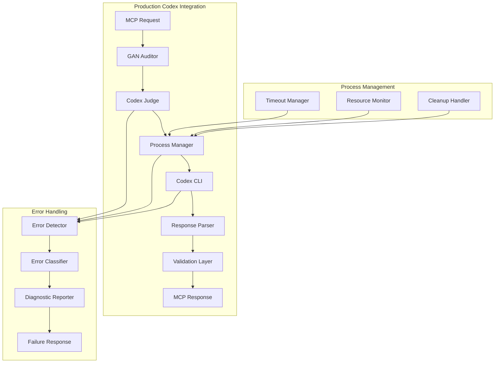

# Design Document

## Overview

This design addresses the critical production issues with Codex CLI integration in the GansAuditor_Codex MCP server. The current implementation has unreliable execution, falls back to mock data, and lacks proper error handling for production environments. This design eliminates all mock functionality, implements robust process management, and ensures reliable Codex CLI execution across different environments.

## Architecture

### Current Architecture Issues

The current system has several architectural problems:

1. **Mock Fallback System**: The `MockCodexJudge` class and fallback mechanisms in `CodexJudge` allow the system to return fake data instead of failing properly
2. **Inadequate Process Management**: Child process handling lacks proper timeout management, resource cleanup, and concurrent execution limits
3. **Environment Inconsistencies**: Working directory and environment variable handling differs between direct execution and MCP environments
4. **Poor Error Handling**: Errors are masked by fallbacks instead of being properly diagnosed and reported

### New Architecture Design



## Components and Interfaces

### 1. Production Codex Judge

**Purpose**: Replace the current `CodexJudge` with a production-ready implementation that never falls back to mock data.

**Key Changes**:
- Remove all fallback mechanisms to mock responses
- Implement strict validation that Codex CLI is available before starting
- Add comprehensive process management with proper cleanup
- Implement robust timeout handling with force-kill capabilities

**Interface**:
```typescript
interface IProductionCodexJudge {
  // Core execution - no fallbacks allowed
  executeAudit(request: AuditRequest): Promise<GanReview>;
  
  // Validation - must pass before any operations
  validateCodexAvailability(): Promise<CodexValidationResult>;
  
  // Process management
  getActiveProcessCount(): number;
  terminateAllProcesses(): Promise<void>;
  
  // Health monitoring
  getHealthStatus(): CodexHealthStatus;
}

interface CodexValidationResult {
  isAvailable: boolean;
  version: string | null;
  executablePath: string | null;
  environmentIssues: string[];
  recommendations: string[];
}

interface CodexHealthStatus {
  isHealthy: boolean;
  activeProcesses: number;
  lastSuccessfulExecution: number | null;
  recentFailures: number;
  averageExecutionTime: number;
}
```

### 2. Process Manager

**Purpose**: Manage Codex CLI child processes with proper resource management, timeouts, and cleanup.

**Key Features**:
- Concurrent process limiting to prevent resource exhaustion
- Proper timeout handling with graceful and force termination
- Environment variable management for MCP compatibility
- Working directory resolution and validation
- Process cleanup on server shutdown

**Interface**:
```typescript
interface ICodexProcessManager {
  executeCommand(
    args: string[],
    options: ProcessExecutionOptions
  ): Promise<ProcessResult>;
  
  getActiveProcessCount(): number;
  terminateAllProcesses(): Promise<void>;
  setProcessLimit(limit: number): void;
}

interface ProcessExecutionOptions {
  workingDirectory: string;
  timeout: number;
  environment: Record<string, string>;
  input?: string;
}

interface ProcessResult {
  stdout: string;
  stderr: string;
  exitCode: number;
  executionTime: number;
  timedOut: boolean;
}
```

### 3. Environment Manager

**Purpose**: Handle environment setup and validation for Codex CLI execution in different contexts (direct vs MCP).

**Key Features**:
- Working directory resolution (repository root detection)
- Environment variable preservation and enhancement
- Path resolution for Codex CLI executable
- MCP-specific environment handling

**Interface**:
```typescript
interface IEnvironmentManager {
  resolveWorkingDirectory(cwd?: string): Promise<string>;
  prepareEnvironment(): Promise<Record<string, string>>;
  validateCodexPath(): Promise<string>;
  detectRepositoryRoot(startPath: string): Promise<string>;
}
```

### 4. Error Diagnostic System

**Purpose**: Replace fallback mechanisms with comprehensive error diagnosis and reporting.

**Key Features**:
- Codex CLI installation detection and guidance
- Environment issue diagnosis
- Process failure analysis
- Actionable error messages with fix suggestions

**Interface**:
```typescript
interface IErrorDiagnosticSystem {
  diagnoseCodexError(error: Error, context: ExecutionContext): CodexDiagnostic;
  generateInstallationGuidance(): InstallationGuidance;
  analyzeEnvironmentIssues(): EnvironmentDiagnostic[];
}

interface CodexDiagnostic {
  category: 'installation' | 'environment' | 'process' | 'timeout' | 'permission';
  severity: 'critical' | 'error' | 'warning';
  message: string;
  details: string;
  suggestions: string[];
  documentationLinks: string[];
}
```

## Data Models

### Configuration Model

```typescript
interface ProductionCodexConfig {
  // Executable configuration
  executable: string;
  executablePaths: string[]; // Search paths for Codex CLI
  
  // Process management
  timeout: number;
  maxConcurrentProcesses: number;
  processCleanupTimeout: number;
  
  // Environment
  preserveEnvironmentVars: string[];
  additionalEnvironmentVars: Record<string, string>;
  
  // Error handling
  maxRetries: number;
  retryDelay: number;
  failFast: boolean; // No fallbacks allowed
  
  // Monitoring
  healthCheckInterval: number;
  performanceMetricsEnabled: boolean;
}
```

### Execution Context Model

```typescript
interface ExecutionContext {
  sessionId?: string;
  thoughtNumber?: number;
  workingDirectory: string;
  requestTimestamp: number;
  auditRequest: AuditRequest;
  processId?: number;
}
```

## Error Handling

### No-Fallback Error Strategy

The new design completely eliminates fallback responses. Instead:

1. **Fail Fast**: If Codex CLI is not available, fail immediately with clear error
2. **Diagnostic Rich**: Provide detailed diagnosis of what went wrong
3. **Actionable**: Include specific steps to fix the issue
4. **Transparent**: Never hide errors behind mock responses

### Error Categories and Responses

1. **Installation Errors**:
   - Codex CLI not found in PATH
   - Codex CLI not executable
   - Wrong version of Codex CLI
   
   **Response**: Installation guidance with platform-specific instructions

2. **Environment Errors**:
   - Working directory not accessible
   - Missing environment variables
   - Permission issues
   
   **Response**: Environment setup instructions and permission fixes

3. **Process Errors**:
   - Timeout exceeded
   - Process crashed
   - Resource exhaustion
   
   **Response**: Process management recommendations and resource optimization

4. **Communication Errors**:
   - Invalid response format
   - Parsing failures
   - Protocol mismatches
   
   **Response**: Codex CLI version compatibility check and update guidance

## Testing Strategy

### Production Readiness Testing

1. **Integration Tests**: Real Codex CLI execution in various environments
2. **Process Management Tests**: Timeout handling, resource limits, cleanup
3. **Error Scenario Tests**: All error conditions without fallbacks
4. **Environment Tests**: Different working directories, environment variables
5. **Concurrent Execution Tests**: Multiple simultaneous audits
6. **Resource Exhaustion Tests**: Behavior under high load

### Mock Removal Verification

1. **Code Analysis**: Ensure no mock code paths exist in production builds
2. **Runtime Verification**: Confirm no mock responses are ever returned
3. **Failure Testing**: Verify proper failure behavior when Codex is unavailable

### Test Environment Setup

```typescript
interface TestEnvironment {
  codexAvailable: boolean;
  workingDirectory: string;
  environmentVars: Record<string, string>;
  processLimits: {
    maxMemory: number;
    maxProcesses: number;
    timeout: number;
  };
}
```

## Implementation Phases

### Phase 1: Mock Removal and Validation
- Remove all mock-related code from production paths
- Implement strict Codex CLI availability validation
- Add fail-fast behavior for missing Codex CLI

### Phase 2: Process Management
- Implement robust process manager with timeout handling
- Add concurrent process limiting
- Implement proper cleanup mechanisms

### Phase 3: Environment Management
- Add working directory resolution
- Implement environment variable management
- Add MCP-specific environment handling

### Phase 4: Error Diagnostics
- Replace fallback mechanisms with diagnostic system
- Add comprehensive error categorization
- Implement actionable error messages

### Phase 5: Monitoring and Health Checks
- Add process health monitoring
- Implement performance metrics
- Add system health endpoints

## Security Considerations

1. **Process Isolation**: Ensure child processes cannot access sensitive data
2. **Resource Limits**: Prevent resource exhaustion attacks
3. **Input Validation**: Sanitize all inputs to Codex CLI
4. **Environment Security**: Avoid exposing sensitive environment variables
5. **Path Validation**: Prevent path traversal in working directory resolution

## Performance Considerations

1. **Process Pooling**: Reuse processes where possible to reduce startup overhead
2. **Timeout Optimization**: Balance between allowing complex audits and preventing hangs
3. **Memory Management**: Monitor and limit memory usage of child processes
4. **Concurrent Limits**: Optimize concurrent process limits based on system resources
5. **Caching**: Cache Codex CLI availability checks and version information

## Monitoring and Observability

1. **Execution Metrics**: Track success rates, execution times, error frequencies
2. **Resource Usage**: Monitor CPU, memory, and process count
3. **Health Checks**: Regular validation of Codex CLI availability
4. **Error Tracking**: Detailed logging of all error conditions
5. **Performance Dashboards**: Real-time monitoring of system health

## Migration Strategy

1. **Backward Compatibility**: Maintain existing interfaces during transition
2. **Feature Flags**: Allow gradual rollout of new implementation
3. **Rollback Plan**: Ability to revert to previous version if issues arise
4. **Documentation Updates**: Update all documentation to reflect new behavior
5. **User Communication**: Clear communication about removal of mock functionality