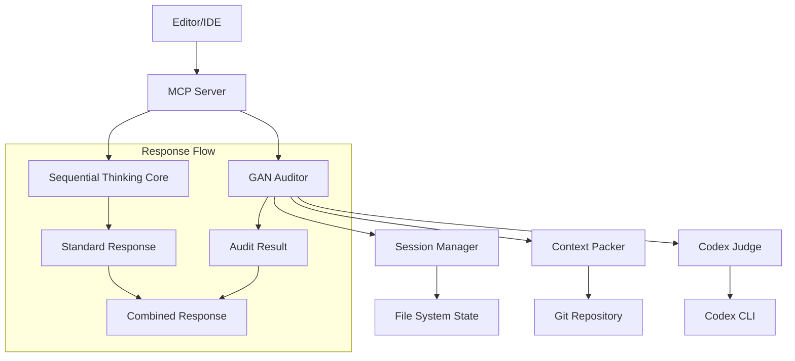
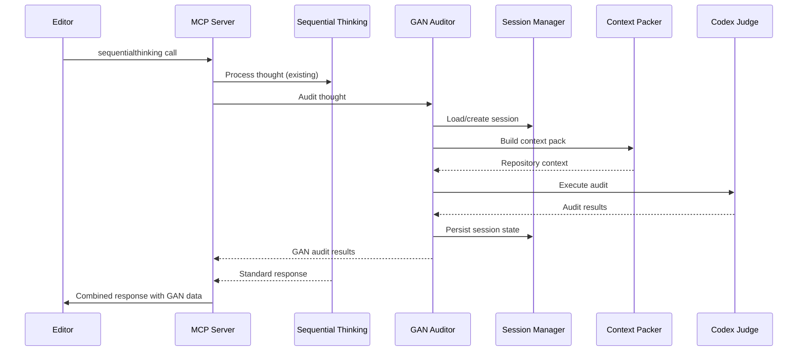

# Design Document

## Overview

The GAN Auditor Integration extends the existing Sequential Thinking MCP server with automated code review capabilities. The system maintains backward compatibility with the existing `sequentialthinking` tool while adding GAN-style auditing that provides iterative feedback until code quality meets specified thresholds.

The design follows a non-intrusive approach, preserving all existing functionality while adding new audit capabilities through:
- Extended response format with GAN audit results
- Session state management for audit continuity
- Repository context analysis for accurate feedback
- Integration with Codex CLI for AI-powered code review

## Architecture

### High-Level Architecture



### Component Interaction Flow



## Components and Interfaces

### 1. Enhanced Sequential Thinking Server

**Responsibilities:**
- Maintain existing sequential thinking functionality
- Coordinate between standard processing and GAN auditing
- Combine responses from both systems

**Key Methods:**
```typescript
class SequentialThinkingServer {
  // Existing methods preserved
  public processThought(input: unknown): Promise<ToolResponse>
  
  // New methods
  private shouldAuditThought(thought: ThoughtData): boolean
  private combineResponses(standard: StandardResponse, audit: GanReview): ToolResponse
}
```

### 2. GAN Auditor Core

**Responsibilities:**
- Orchestrate the audit process
- Manage audit configuration
- Coordinate between session management, context building, and judging

**Interface:**
```typescript
interface GanAuditor {
  auditThought(thought: ThoughtData, sessionId: string): Promise<GanReview>
  extractInlineConfig(thought: string): Partial<SessionConfig> | null
}

class GanAuditorImpl implements GanAuditor {
  constructor(
    private sessionManager: SessionManager,
    private contextPacker: ContextPacker,
    private codexJudge: CodexJudge
  )
}
```

### 3. Session Manager

**Responsibilities:**
- Persist and retrieve session state
- Manage session configuration
- Track audit history and progress

**Interface:**
```typescript
interface SessionManager {
  getSession(id: string): SessionState | null
  createSession(id: string, config: SessionConfig): SessionState
  updateSession(session: SessionState): void
  generateSessionId(): string
}

interface SessionState {
  id: string
  config: SessionConfig
  history: AuditHistoryEntry[]
  lastGan?: GanReview
}

interface SessionConfig {
  task: string
  scope: "diff" | "paths" | "workspace"
  paths?: string[]
  threshold: number
  maxCycles: number
  candidates: number
  judges: string[]
  applyFixes: boolean
}
```

### 4. Context Packer

**Responsibilities:**
- Build repository context based on scope configuration
- Generate git diffs, file trees, and code snippets
- Manage context size and relevance

**Interface:**
```typescript
interface ContextPacker {
  buildContextPack(config: SessionConfig): Promise<string>
}

class ContextPackerImpl implements ContextPacker {
  private async buildDiffContext(): Promise<string>
  private async buildPathsContext(paths: string[]): Promise<string>
  private async buildWorkspaceContext(): Promise<string>
  private async getGitHeader(): Promise<string>
  private async getRepoTree(maxDepth: number): Promise<string>
  private pickRelevantFiles(root: string, limit: number): string[]
  private collectTopSnippets(paths: string[], topK: number, maxTokens: number): string
}
```

### 5. Codex Judge

**Responsibilities:**
- Execute Codex CLI commands for code analysis
- Parse and validate audit results
- Handle Codex execution errors gracefully

**Interface:**
```typescript
interface CodexJudge {
  executeAudit(auditRequest: AuditRequest): Promise<GanReview>
}

interface AuditRequest {
  task: string
  candidate: string
  contextPack: string
  rubric: AuditRubric
  budget: AuditBudget
}

interface AuditRubric {
  dimensions: Array<{ name: string; weight: number }>
}

interface AuditBudget {
  maxCycles: number
  candidates: number
  threshold: number
}
```

## Data Models

### Core Data Types

```typescript
// Extended from existing ThoughtData
interface ThoughtData {
  thought: string
  thoughtNumber: number
  totalThoughts: number
  nextThoughtNeeded: boolean
  isRevision?: boolean
  revisesThought?: number
  branchFromThought?: number
  branchId?: string  // Used as session ID
  needsMoreThoughts?: boolean
}

// GAN Audit Results
type GanVerdict = "pass" | "revise" | "reject"

interface GanReview {
  overall: number  // 0-100
  dimensions: Array<{ name: string; score: number }>
  verdict: GanVerdict
  review: {
    summary: string
    inline: Array<{ path: string; line: number; comment: string }>
    citations: string[]  // Format: "repo://path:start-end"
  }
  proposed_diff?: string | null
  iterations: number
  judge_cards: Array<{ model: string; score: number; notes?: string }>
}

// Enhanced Response Format
interface EnhancedToolResponse {
  // Existing fields
  thoughtNumber: number
  totalThoughts: number
  nextThoughtNeeded: boolean
  branches: string[]
  thoughtHistoryLength: number
  
  // New fields
  sessionId?: string
  gan?: GanReview
}
```

### Configuration Schema

```typescript
interface SessionConfig {
  task: string                    // Default: "Audit and improve the provided candidate"
  scope: "diff" | "paths" | "workspace"  // Default: "diff"
  paths?: string[]               // Required when scope is "paths"
  threshold: number              // Default: 85 (0-100)
  maxCycles: number             // Default: 1
  candidates: number            // Default: 1
  judges: string[]              // Default: ["internal"]
  applyFixes: boolean           // Default: false
}
```

## Error Handling

### Error Categories and Strategies

1. **Configuration Errors**
   - Invalid inline config JSON → Fall back to defaults
   - Missing required paths for "paths" scope → Switch to "workspace" scope
   - Invalid threshold values → Clamp to valid range (0-100)

2. **Codex Integration Errors**
   - Codex CLI not found → Return error with installation instructions
   - Codex execution timeout → Return partial results with timeout notice
   - Invalid JSON response → Attempt greedy parsing, fall back to basic response

3. **File System Errors**
   - Session state persistence failure → Continue without persistence, log warning
   - Git command failures → Provide context without git information
   - File access errors → Skip inaccessible files, continue with available context

4. **Session Management Errors**
   - Corrupted session state → Create new session with warning
   - Session ID conflicts → Generate new unique ID
   - State directory creation failure → Use in-memory state only

### Error Response Format

```typescript
interface ErrorResponse {
  error: string
  status: "failed"
  details?: {
    category: "config" | "codex" | "filesystem" | "session"
    recoverable: boolean
    suggestions?: string[]
  }
}
```

## Testing Strategy

### Unit Testing Approach

1. **Component Isolation**
   - Mock external dependencies (Codex CLI, file system, git)
   - Test each component independently
   - Verify interface contracts

2. **Configuration Testing**
   - Test inline config parsing with various JSON formats
   - Verify default value application
   - Test configuration validation and sanitization

3. **Session Management Testing**
   - Test session creation, persistence, and retrieval
   - Verify session state consistency
   - Test concurrent session handling

4. **Context Building Testing**
   - Test different scope modes (diff, paths, workspace)
   - Verify context size limits and truncation
   - Test file relevance scoring algorithms

### Integration Testing Approach

1. **End-to-End Workflow Testing**
   - Simulate complete editor-to-tool-to-editor cycles
   - Test session continuity across multiple calls
   - Verify response format compatibility

2. **Codex Integration Testing**
   - Test with mock Codex responses
   - Verify error handling for Codex failures
   - Test JSON parsing edge cases

3. **Backward Compatibility Testing**
   - Ensure existing sequential thinking functionality unchanged
   - Test with existing editor integrations
   - Verify response format extensions don't break clients

### Test Data and Scenarios

1. **Sample Repository Contexts**
   - Small TypeScript project with git history
   - Multi-language project with various file types
   - Large project requiring context truncation

2. **Audit Scenarios**
   - Code with obvious issues (syntax errors, style violations)
   - High-quality code that should pass audit
   - Edge cases (empty files, binary files, very large files)

3. **Configuration Scenarios**
   - Default configuration usage
   - Custom threshold and scope settings
   - Invalid configuration handling

### Performance Testing

1. **Context Building Performance**
   - Measure time to build context for various repository sizes
   - Test memory usage with large codebases
   - Verify context truncation effectiveness

2. **Session State Performance**
   - Test session persistence with many concurrent sessions
   - Measure state file I/O performance
   - Test session cleanup and garbage collection

3. **Codex Integration Performance**
   - Measure Codex CLI execution time
   - Test timeout handling
   - Monitor resource usage during audit execution