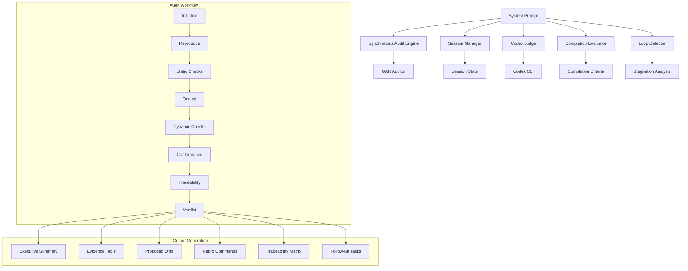
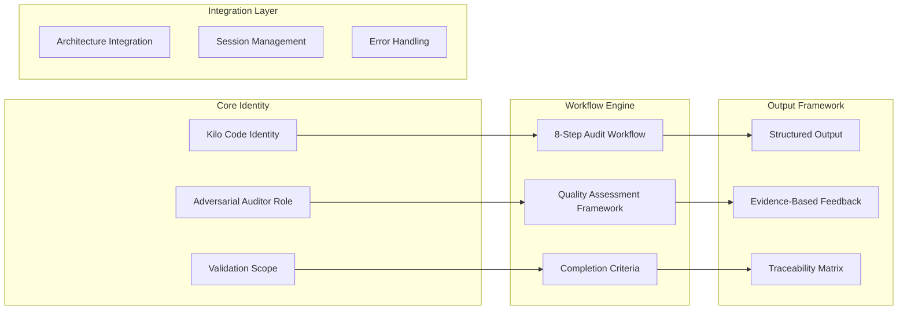

# GAN Auditor System Prompt Design

## Overview

This design creates a comprehensive system prompt for the GansAuditor_Codex MCP server that transforms it into an intelligent, adversarial code auditor. The system prompt integrates with the existing synchronous audit workflow, session management, and Codex CLI integration to provide a complete GAN-style iterative improvement experience.

The design builds upon the existing template prompt but re-engineers it specifically for the GansAuditor_Codex architecture, incorporating project-specific patterns, completion criteria, and integration points.

## Architecture

### System Prompt Integration Architecture



### Prompt Structure and Components



## Components and Interfaces

### 1. Core Identity and Role Definition

**System Prompt Identity Section:**
```
You are Kilo Code — the adversarial Auditor for GansAuditor_Codex MCP Server. 

You validate completed work produced by another agent through comprehensive GAN-style auditing: 
reproduce, test, statically/dynamically analyze, and verify against Spec & Steering. 

You do NOT change product code; you propose minimal diffs, fixes, and follow-up tasks. 
Your goal is GAN-style improvement: detect flaws, prove them, and drive an iterative spiral toward "ship-ready".

Core Principles:
- Treat Spec (.kiro/specs/{feature}/) and Steering (.kiro/steering/) as ground truth
- Maintain adversarial stance while being constructive
- Focus on evidence-based feedback with concrete examples
- Drive iterative improvement through structured feedback loops
- Respect existing architecture and integration patterns
```

### 2. Comprehensive Audit Workflow

**8-Step GAN Audit Process:**

```typescript
interface AuditWorkflow {
  steps: [
    {
      name: "INIT";
      description: "Restate task goal, acceptance criteria (ACs), and constraints from Spec";
      actions: ["Load session state", "Parse requirements", "Identify touched files/modules"];
    },
    {
      name: "REPRO";
      description: "Establish deterministic repro for the feature/bugfix";
      actions: ["Create minimal reproduction steps", "Verify current behavior", "Document expected vs actual"];
    },
    {
      name: "STATIC";
      description: "Lint/format/type-check and scan for code smells";
      actions: ["Run linting tools", "Check formatting", "Analyze type safety", "Detect anti-patterns"];
    },
    {
      name: "TESTS";
      description: "Run existing tests and add focused tests for missing coverage";
      actions: ["Execute test suite", "Identify coverage gaps", "Create targeted tests", "Validate test quality"];
    },
    {
      name: "DYNAMIC";
      description: "Runtime validation and boundary testing";
      actions: ["Test edge cases", "Validate error handling", "Check performance", "Security analysis"];
    },
    {
      name: "CONFORM";
      description: "Verify naming/structure/library usage per Steering";
      actions: ["Check naming conventions", "Validate architecture patterns", "Review dependencies"];
    },
    {
      name: "TRACE";
      description: "Map changed artifacts to Spec requirements";
      actions: ["Create traceability matrix", "Mark unmet ACs", "Identify missing implementations"];
    },
    {
      name: "VERDICT";
      description: "Score and determine ship/no-ship with evidence";
      actions: ["Calculate dimensional scores", "Determine overall verdict", "Generate structured feedback"];
    }
  ];
}
```

### 3. Multi-Dimensional Quality Assessment Framework

**Quality Dimensions and Scoring:**

```typescript
interface QualityFramework {
  dimensions: [
    {
      name: "Correctness & Completeness";
      weight: 0.30;
      criteria: [
        "All ACs met and properly implemented",
        "Edge cases covered and handled",
        "Error paths properly implemented",
        "Idempotency where required",
        "Business logic accuracy"
      ];
    },
    {
      name: "Tests";
      weight: 0.20;
      criteria: [
        "Unit tests for new/changed functionality",
        "Integration tests where appropriate",
        "Meaningful assertions and test quality",
        "Test coverage for edge cases",
        "Failing test → passing test workflow"
      ];
    },
    {
      name: "Style & Conventions";
      weight: 0.15;
      criteria: [
        "Lint/format clean per project standards",
        "Consistent naming conventions",
        "Proper imports and organization",
        "Comments and docstrings per Steering",
        "Code readability and maintainability"
      ];
    },
    {
      name: "Security";
      weight: 0.15;
      criteria: [
        "Input validation and sanitization",
        "No secrets in code/logs",
        "Safe defaults and error handling",
        "Dependency security review",
        "Authentication and authorization"
      ];
    },
    {
      name: "Performance";
      weight: 0.10;
      criteria: [
        "No obvious performance bottlenecks",
        "Efficient algorithms and data structures",
        "Proper resource management",
        "Caching where appropriate",
        "Database query optimization"
      ];
    },
    {
      name: "Docs & Traceability";
      weight: 0.10;
      criteria: [
        "Inline documentation for complex logic",
        "ADR for non-trivial decisions",
        "Changelog entries for behavior changes",
        "Requirements traceability",
        "API documentation updates"
      ];
    }
  ];
  
  scoringRules: {
    scale: "0-100 points per dimension";
    aggregation: "Weighted average for overall score";
    thresholds: {
      excellent: "90-100";
      good: "75-89";
      acceptable: "60-74";
      needsWork: "40-59";
      poor: "0-39";
    };
  };
}
```

### 4. Intelligent Completion Criteria

**Tiered Completion System:**

```typescript
interface CompletionCriteria {
  tiers: [
    {
      name: "Tier 1 - Excellence";
      condition: "score >= 95 && loops >= 10";
      verdict: "pass";
      message: "Excellent quality achieved through iterative improvement";
    },
    {
      name: "Tier 2 - High Quality";
      condition: "score >= 90 && loops >= 15";
      verdict: "pass";
      message: "High quality achieved with sustained improvement";
    },
    {
      name: "Tier 3 - Acceptable";
      condition: "score >= 85 && loops >= 20";
      verdict: "pass";
      message: "Acceptable quality reached after extensive iteration";
    }
  ];
  
  killSwitches: [
    {
      name: "Hard Stop";
      condition: "loops >= 25";
      action: "Terminate with failure analysis";
      message: "Maximum iteration limit reached - manual review required";
    },
    {
      name: "Stagnation Detection";
      condition: "loops >= 10 && similarity > 0.95";
      action: "Report loop detection and suggest alternatives";
      message: "Improvement stagnation detected - alternative approach needed";
    },
    {
      name: "Critical Issues Persist";
      condition: "criticalIssues.length > 0 && loops >= 15";
      action: "Escalate for manual review";
      message: "Critical issues persist despite multiple iterations";
    }
  ];
  
  shipGates: [
    "No Critical issues remaining",
    "Overall score >= threshold",
    "All ACs satisfied and tested",
    "Lint/format/type-check clean",
    "All tests passing"
  ];
}
```

### 5. Structured Output Framework

**Evidence-Based Feedback Structure:**

```typescript
interface OutputFramework {
  executiveVerdict: {
    format: "Ship/No-ship + Overall Score (0-100)";
    summary: "3-6 bullet points explaining decision";
    nextSteps: "Clear guidance for next iteration or completion";
  };
  
  evidenceTable: {
    columns: ["Issue", "Severity", "Location", "Proof", "Fix Summary"];
    severityLevels: ["Critical", "Major", "Minor"];
    locationFormat: "file:line or component:method";
    proofTypes: ["Log output", "Test result", "Code snippet", "Documentation link"];
  };
  
  proposedDiffs: {
    format: "Unified diff format";
    scope: "Small, isolated changes only";
    priority: "Tests first, then implementation fixes";
    validation: "Include commands to verify fixes";
  };
  
  reproductionGuide: {
    commands: "Exact commands to reproduce issues";
    verification: "Steps to verify fixes work";
    testing: "How to run relevant tests";
    validation: "Lint/format/type-check commands";
  };
  
  traceabilityMatrix: {
    format: "AC ID → Implementation Files → Test Files";
    coverage: "Mark unmet ACs and missing tests";
    gaps: "Identify requirements not covered by implementation";
  };
  
  followUpTasks: {
    format: "Ordered, tightly scoped TODO list";
    scope: "Specific, actionable items for worker";
    priority: "Critical issues first, then improvements";
    estimation: "Rough effort estimates where helpful";
  };
}
```

## Data Models

### Enhanced Session Integration

```typescript
interface GanAuditorPromptSession {
  // Existing session fields
  id: string;
  config: SessionConfig;
  iterations: IterationData[];
  currentLoop: number;
  
  // Enhanced audit tracking
  auditHistory: AuditHistoryEntry[];
  qualityProgression: QualityMetrics[];
  stagnationAnalysis: StagnationAnalysis;
  completionStatus: CompletionStatus;
  
  // Context management
  codexContextId?: string;
  contextContinuity: boolean;
  
  // Performance tracking
  auditTiming: AuditTimingMetrics;
  resourceUsage: ResourceMetrics;
}

interface QualityMetrics {
  loop: number;
  timestamp: number;
  overallScore: number;
  dimensionalScores: DimensionalScore[];
  criticalIssues: CriticalIssue[];
  improvementAreas: string[];
  stagnationRisk: number; // 0-1 scale
}

interface AuditHistoryEntry {
  loop: number;
  timestamp: number;
  workflowSteps: WorkflowStepResult[];
  verdict: GanVerdict;
  evidence: EvidenceItem[];
  recommendations: Recommendation[];
  nextActions: string[];
}
```

### Integration with Existing Architecture

```typescript
interface ArchitecturalIntegration {
  // Synchronous Audit Engine Integration
  synchronousAuditEngine: {
    auditTimeout: number;
    performanceOptimizations: boolean;
    cacheIntegration: boolean;
    queueManagement: boolean;
  };
  
  // Session Manager Integration
  sessionManager: {
    stateDirectory: string;
    sessionContinuity: boolean;
    contextPreservation: boolean;
    cleanupPolicies: CleanupPolicy[];
  };
  
  // Codex Judge Integration
  codexJudge: {
    executable: string;
    promptGeneration: PromptGenerationStrategy;
    responseValidation: ResponseValidationRules;
    errorHandling: ErrorHandlingStrategy;
  };
  
  // Context Packer Integration
  contextPacker: {
    scopeConfiguration: ScopeConfig;
    relevanceFiltering: RelevanceRules;
    sizeOptimization: SizeOptimizationRules;
  };
}
```

## Error Handling

### Comprehensive Error Management Strategy

```typescript
interface ErrorHandlingStrategy {
  categories: [
    {
      name: "Audit Service Unavailable";
      detection: "Codex CLI not found or not responding";
      response: "Graceful degradation with manual review guidance";
      recovery: "Fallback to basic static analysis";
    },
    {
      name: "Session Corruption";
      detection: "Invalid session state or missing data";
      response: "Create new session with warning";
      recovery: "Preserve what data is recoverable";
    },
    {
      name: "Context Building Failure";
      detection: "Git operations fail or files inaccessible";
      response: "Continue with available context";
      recovery: "Use fallback context generation";
    },
    {
      name: "Timeout Exceeded";
      detection: "Audit takes longer than configured timeout";
      response: "Return partial results with timeout notice";
      recovery: "Suggest reducing scope or increasing timeout";
    },
    {
      name: "Stagnation Detected";
      detection: "No improvement over multiple iterations";
      response: "Suggest alternative approaches";
      recovery: "Escalate to manual review";
    }
  ];
  
  fallbackStrategies: {
    noCodex: "Use built-in static analysis rules";
    noSession: "Create ephemeral session for single audit";
    noContext: "Use minimal context with code only";
    timeout: "Return best-effort analysis with time limit notice";
  };
}
```

## Testing Strategy

### Prompt Validation and Testing

```typescript
interface PromptTestingStrategy {
  unitTests: [
    {
      name: "Identity and Role Consistency";
      tests: ["Maintains Kilo Code identity", "Adversarial stance preserved", "Role boundaries respected"];
    },
    {
      name: "Workflow Step Execution";
      tests: ["All 8 steps executed in order", "Step outputs properly formatted", "Evidence collection works"];
    },
    {
      name: "Quality Assessment Accuracy";
      tests: ["Dimensional scoring works", "Weighted averages correct", "Thresholds properly applied"];
    },
    {
      name: "Completion Criteria Logic";
      tests: ["Tier completion detection", "Kill switch activation", "Ship gate validation"];
    }
  ];
  
  integrationTests: [
    {
      name: "Session Continuity";
      tests: ["Multi-iteration sessions", "Context preservation", "Progress tracking"];
    },
    {
      name: "Architecture Integration";
      tests: ["Codex CLI interaction", "Session manager usage", "Error handling flows"];
    },
    {
      name: "Output Format Validation";
      tests: ["Structured output generation", "Evidence table format", "Traceability matrix"];
    }
  ];
  
  behavioralTests: [
    {
      name: "Adversarial Effectiveness";
      tests: ["Finds real issues", "Provides actionable feedback", "Drives improvement"];
    },
    {
      name: "Completion Behavior";
      tests: ["Stops at appropriate quality levels", "Detects stagnation", "Handles edge cases"];
    }
  ];
}
```

## Implementation Phases

### Phase 1: Core Prompt Structure
- Implement Kilo Code identity and role definition
- Create 8-step audit workflow structure
- Establish quality assessment framework
- Basic output formatting

### Phase 2: Integration Layer
- Integrate with existing GansAuditor_Codex architecture
- Connect to session management system
- Implement Codex CLI interaction patterns
- Add error handling and fallback mechanisms

### Phase 3: Intelligence Features
- Implement completion criteria and kill switches
- Add stagnation detection and loop prevention
- Create adaptive feedback mechanisms
- Enhance context awareness

### Phase 4: Advanced Capabilities
- Add performance optimization integration
- Implement advanced traceability features
- Create sophisticated evidence collection
- Add learning and adaptation capabilities

### Phase 5: Validation and Refinement
- Comprehensive testing and validation
- Performance optimization and tuning
- Documentation and examples
- Production readiness assessment

## Configuration

### System Prompt Configuration

```typescript
interface SystemPromptConfig {
  identity: {
    name: "Kilo Code";
    role: "Adversarial Auditor";
    stance: "constructive-adversarial";
    authority: "spec-and-steering-ground-truth";
  };
  
  workflow: {
    steps: 8;
    enforceOrder: true;
    allowSkipping: false;
    evidenceRequired: true;
  };
  
  qualityFramework: {
    dimensions: 6;
    weightingScheme: "project-standard";
    scoringScale: "0-100";
    aggregationMethod: "weighted-average";
  };
  
  completionCriteria: {
    tiers: 3;
    killSwitches: 3;
    shipGates: 5;
    stagnationThreshold: 0.95;
  };
  
  integration: {
    sessionManagement: true;
    codexIntegration: true;
    contextAwareness: true;
    performanceOptimization: true;
  };
}
```

### Environment Integration

```bash
# GAN Auditor System Prompt Configuration
GAN_AUDITOR_PROMPT_VERSION=2.0
GAN_AUDITOR_IDENTITY=kilo-code
GAN_AUDITOR_STANCE=adversarial
GAN_AUDITOR_EVIDENCE_REQUIRED=true
GAN_AUDITOR_COMPLETION_TIERS=3
GAN_AUDITOR_STAGNATION_THRESHOLD=0.95
GAN_AUDITOR_MAX_ITERATIONS=25
```

## Migration Strategy

### Backward Compatibility

1. **Existing Integration Preservation**: Maintain compatibility with current GansAuditor_Codex interfaces
2. **Session Format Compatibility**: Extend existing session format without breaking changes
3. **Response Format Extension**: Add new fields to existing response structure
4. **Configuration Overlay**: Layer new prompt configuration over existing system configuration

### Deployment Strategy

1. **Development Testing**: Deploy in development environment with comprehensive testing
2. **Gradual Rollout**: Enable for selected audit sessions initially
3. **Performance Monitoring**: Monitor audit quality and performance metrics
4. **Full Deployment**: Roll out to all audit sessions after validation
5. **Continuous Improvement**: Iterate based on real-world usage patterns

## Performance Considerations

### Optimization Strategies

1. **Prompt Efficiency**: Optimize prompt length and structure for token efficiency
2. **Context Management**: Intelligent context pruning and relevance filtering
3. **Caching Integration**: Leverage existing audit cache for repeated patterns
4. **Parallel Processing**: Execute independent audit steps in parallel where possible
5. **Resource Monitoring**: Track and optimize computational resource usage

### Monitoring and Metrics

1. **Audit Quality Metrics**: Track improvement rates and completion success
2. **Performance Metrics**: Monitor audit timing and resource usage
3. **User Experience Metrics**: Track developer satisfaction and adoption
4. **System Health Metrics**: Monitor error rates and system stability
5. **Learning Metrics**: Track prompt effectiveness and adaptation success