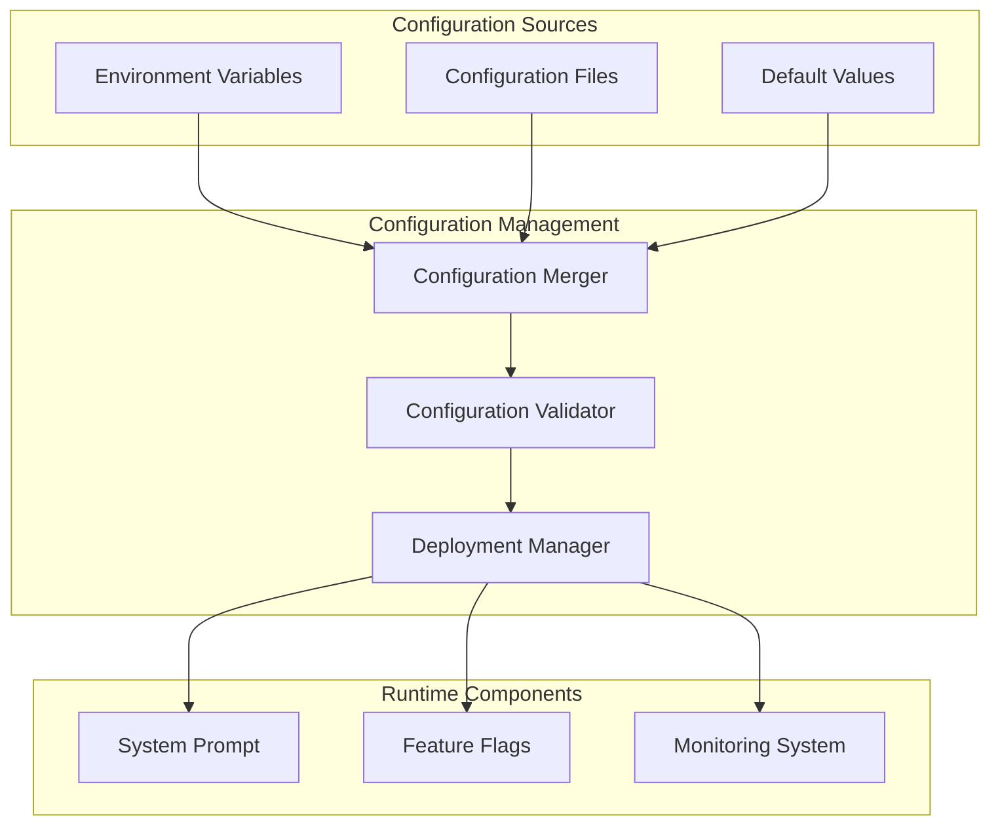

# System Prompt Configuration Deployment Guide

This guide provides comprehensive instructions for deploying, configuring, and managing the GAN Auditor system prompt configuration across different environments.

## Table of Contents

1. [Overview](#overview)
2. [Quick Start](#quick-start)
3. [Configuration Management](#configuration-management)
4. [Deployment Strategies](#deployment-strategies)
5. [Feature Flags](#feature-flags)
6. [Monitoring and Observability](#monitoring-and-observability)
7. [Migration and Upgrades](#migration-and-upgrades)
8. [Troubleshooting](#troubleshooting)
9. [Best Practices](#best-practices)

## Overview

The GAN Auditor system prompt configuration provides a comprehensive framework for managing adversarial code auditing with:

- **Environment-specific configurations** for development, staging, and production
- **Feature flag management** for gradual rollout and A/B testing
- **Automated deployment and migration** with backup and rollback capabilities
- **Real-time monitoring and alerting** for system health and performance
- **Comprehensive validation** to ensure configuration integrity

### Architecture Overview



## Quick Start

### 1. Basic Setup

```bash
# Install dependencies
npm install

# Create default configuration
npm run config:create config/system-prompt.json development

# Validate configuration
npm run config:validate

# Generate environment variables documentation
npm run config:env-vars --format markdown --output docs/environment-variables.md
```

### 2. Environment Configuration

Create environment-specific configuration files:

```bash
# Development environment
npm run config:create config/system-prompt-dev.json development

# Staging environment  
npm run config:create config/system-prompt-staging.json staging

# Production environment
npm run config:create config/system-prompt-prod.json production
```

### 3. Environment Variables

Set the following environment variables:

```bash
# Core settings
export GAN_AUDITOR_PROMPT_ENABLED=true
export GAN_AUDITOR_PROMPT_CONFIG_FILE=config/system-prompt.json

# Security settings (required for production)
export GAN_AUDITOR_SANITIZE_PII=true
export GAN_AUDITOR_VALIDATE_COMMANDS=true
export GAN_AUDITOR_RESPECT_PERMISSIONS=true

# Performance settings
export GAN_AUDITOR_CONTEXT_TOKEN_LIMIT=200000
export GAN_AUDITOR_AUDIT_TIMEOUT_MS=30000
```

### 4. Validation and Deployment

```bash
# Validate configuration
npm run config:validate config/system-prompt.json

# Deploy to development
node scripts/system-prompt-config.js deploy config/system-prompt-dev.json development

# Generate monitoring dashboard
npm run config:report --output monitoring-report.html
```

## Configuration Management

### Configuration File Structure

```json
{
  "version": "2.0.0",
  "systemPrompt": {
    "identity": {
      "name": "Kilo Code",
      "role": "Adversarial Auditor",
      "stance": "constructive-adversarial",
      "authority": "spec-and-steering-ground-truth"
    },
    "workflow": {
      "steps": 8,
      "enforceOrder": true,
      "allowSkipping": false,
      "evidenceRequired": true
    },
    "qualityFramework": {
      "dimensions": 6,
      "weightingScheme": "project-standard",
      "scoringScale": "0-100",
      "aggregationMethod": "weighted-average"
    },
    "completionCriteria": {
      "tiers": 3,
      "killSwitches": 3,
      "shipGates": 5,
      "stagnationThreshold": 0.95,
      "maxIterations": 25
    },
    "integration": {
      "sessionManagement": true,
      "codexIntegration": true,
      "contextAwareness": true,
      "performanceOptimization": true
    },
    "security": {
      "sanitizePII": true,
      "validateCommands": true,
      "respectPermissions": true,
      "flagVulnerabilities": true
    },
    "performance": {
      "contextTokenLimit": 200000,
      "auditTimeoutMs": 30000,
      "enableCaching": true,
      "enableProgressTracking": true
    }
  },
  "metadata": {
    "createdAt": "2024-01-15T10:30:00Z",
    "updatedAt": "2024-01-15T10:30:00Z",
    "description": "System prompt configuration for development environment",
    "environment": "development"
  }
}
```

### Configuration Validation

The system provides comprehensive validation for all configuration aspects:

```bash
# Validate configuration file
npm run config:validate config/system-prompt.json --strict

# Validate environment variables
npm run config:validate

# Generate validation report
npm run config:report config/system-prompt.json --format markdown
```

#### Validation Checks

- **Structure validation**: Ensures all required sections are present
- **Value validation**: Checks data types, ranges, and constraints
- **Cross-validation**: Verifies consistency between related settings
- **Environment validation**: Checks environment-specific requirements
- **Security validation**: Ensures security settings meet requirements

### Configuration Precedence

Configuration values are resolved in the following order (highest to lowest precedence):

1. **Environment Variables** - Runtime overrides
2. **Configuration File** - Environment-specific settings
3. **Default Values** - Built-in fallbacks

```javascript
// Example: Loading configuration with precedence
import { loadSystemPromptConfig } from './src/prompts/system-prompt-config.js';

const { config, validation, sources } = loadSystemPromptConfig('config/system-prompt.json');

console.log('Configuration sources used:', sources);
// Output: { defaults: true, configFile: true, environment: true }
```

## Deployment Strategies

### 1. Environment-Specific Deployment

Deploy configurations tailored to specific environments:

```bash
# Development deployment (relaxed settings)
node scripts/deploy-config.js \
  --config config/system-prompt-dev.json \
  --environment development \
  --validate \
  --backup

# Production deployment (strict settings)
node scripts/deploy-config.js \
  --config config/system-prompt-prod.json \
  --environment production \
  --validate \
  --backup \
  --require-approval
```

### 2. Gradual Rollout

Use feature flags for gradual rollout:

```json
{
  "featureFlags": {
    "systemPromptEnabled": {
      "enabled": true,
      "rolloutPercentage": 25,
      "environments": ["production"],
      "conditions": [
        {
          "type": "environment",
          "operator": "equals",
          "value": "production"
        }
      ]
    }
  }
}
```

### 3. Blue-Green Deployment

Deploy to staging environment first, then promote to production:

```bash
# Deploy to staging
npm run deploy:staging

# Validate staging deployment
npm run validate:staging

# Promote to production
npm run deploy:production --from-staging
```

### 4. Canary Deployment

Deploy to a subset of users first:

```bash
# Deploy canary version (10% of traffic)
node scripts/deploy-config.js \
  --config config/system-prompt-canary.json \
  --environment production \
  --rollout-percentage 10 \
  --monitor

# Monitor canary metrics
npm run monitor:canary

# Promote canary to full deployment
npm run promote:canary
```

## Feature Flags

### Feature Flag Configuration

```json
{
  "flags": {
    "systemPromptEnabled": {
      "name": "systemPromptEnabled",
      "description": "Enable system prompt functionality",
      "enabled": true,
      "rolloutPercentage": 100,
      "environments": ["development", "staging", "production"]
    },
    "advancedWorkflow": {
      "name": "advancedWorkflow", 
      "description": "Enable advanced 8-step audit workflow",
      "enabled": true,
      "rolloutPercentage": 100,
      "environments": ["staging", "production"],
      "conditions": [
        {
          "type": "environment",
          "operator": "in",
          "value": ["staging", "production"]
        }
      ]
    },
    "experimentalFeatures": {
      "name": "experimentalFeatures",
      "description": "Enable experimental features",
      "enabled": false,
      "rolloutPercentage": 10,
      "environments": ["development"]
    }
  }
}
```

### Managing Feature Flags

```javascript
import { FeatureFlagManager } from './src/config/feature-flag-manager.js';

// Create feature flag manager
const flagManager = new FeatureFlagManager();

// Check if feature is enabled
const isEnabled = flagManager.isEnabled('advancedWorkflow', {
  environment: 'production',
  sessionId: 'user-session-123'
});

// Get rollout summary
const summary = flagManager.getRolloutSummary();
console.log(`${summary.enabledFlags}/${summary.totalFlags} flags enabled`);

// Update flag rollout percentage
flagManager.updateFlag('experimentalFeatures', {
  rolloutPercentage: 25
});
```

### Environment-Specific Flags

```bash
# Development environment - all features enabled
export GAN_AUDITOR_EXPERIMENTAL_FEATURES=true
export GAN_AUDITOR_DEBUG_MODE=true
export GAN_AUDITOR_ENHANCED_SECURITY=false

# Production environment - stable features only
export GAN_AUDITOR_EXPERIMENTAL_FEATURES=false
export GAN_AUDITOR_DEBUG_MODE=false
export GAN_AUDITOR_ENHANCED_SECURITY=true
```

## Monitoring and Observability

### Metrics Collection

The system automatically collects comprehensive metrics:

```javascript
import { Metrics } from './src/config/monitoring-system.js';

// Record configuration validation
Metrics.recordConfigValidation(true, 1500);

// Record deployment
Metrics.recordConfigDeployment('production', true, 5000, true);

// Record audit quality
Metrics.recordAuditQuality(true, 85.5, 30000, 5);
```

### Dashboard Generation

Generate real-time monitoring dashboards:

```bash
# Generate HTML dashboard
npm run dashboard:generate --output monitoring/dashboard.html

# Generate metrics report
npm run metrics:report --format json --output monitoring/metrics.json

# Start monitoring server
npm run monitoring:start --port 3000
```

### Alerting Configuration

Configure alerts for critical events:

```json
{
  "alerts": [
    {
      "id": "config-validation-errors",
      "name": "Configuration Validation Errors",
      "severity": "error",
      "condition": {
        "metric": "configValidationErrors",
        "operator": "gt",
        "threshold": 5,
        "windowMs": 300000,
        "aggregation": "sum"
      },
      "enabled": true,
      "cooldownMs": 600000
    },
    {
      "id": "deployment-failures",
      "name": "Deployment Failures", 
      "severity": "critical",
      "condition": {
        "metric": "configDeploymentErrors",
        "operator": "gt",
        "threshold": 2,
        "windowMs": 600000,
        "aggregation": "sum"
      },
      "enabled": true,
      "cooldownMs": 1800000
    }
  ]
}
```

### Environment Variables for Monitoring

```bash
# Enable monitoring
export GAN_AUDITOR_MONITORING_ENABLED=true
export GAN_AUDITOR_METRICS_RETENTION_DAYS=30
export GAN_AUDITOR_ALERTING_ENABLED=true

# Configure output
export GAN_AUDITOR_MONITORING_DIR=./monitoring
export GAN_AUDITOR_WEBHOOK_URL=https://hooks.slack.com/your-webhook

# Set log level
export GAN_AUDITOR_LOG_LEVEL=info
```

## Migration and Upgrades

### Automatic Migration

The system supports automatic migration between configuration versions:

```bash
# Check compatibility
npm run config:check-compatibility config/legacy-config.json

# Apply migrations
npm run config:migrate config/legacy-config.json

# Validate migrated configuration
npm run config:validate config/legacy-config.json
```

### Migration Scripts

```javascript
import { migrateConfiguration, checkCompatibility } from './src/config/deployment-manager.js';

// Check if migration is needed
const compatibility = checkCompatibility('config/old-config.json');
if (!compatibility.isCompatible) {
  console.log('Migration required:', compatibility.migrationPath);
  
  // Apply migration
  const result = migrateConfiguration('config/old-config.json');
  if (result.success) {
    console.log('Migration completed:', result.migrationsApplied);
  }
}
```

### Backup and Rollback

```bash
# Create backup before deployment
npm run config:backup config/system-prompt.json

# Deploy with automatic backup
npm run deploy --backup --rollback-on-failure

# Manual rollback
npm run config:restore config/system-prompt.json.backup.2024-01-15T10-30-00-000Z
```

### Version Compatibility Matrix

| From Version | To Version | Migration Required | Breaking Changes |
|--------------|------------|-------------------|------------------|
| 1.0.0        | 2.0.0      | Yes               | Configuration structure |
| 2.0.0        | 2.1.0      | Yes               | New security features |
| 2.1.0        | 2.2.0      | No                | Backward compatible |

## Troubleshooting

### Common Issues

#### 1. Configuration Validation Errors

**Problem**: Configuration validation fails with schema errors.

**Solution**:
```bash
# Check configuration structure
npm run config:validate config/system-prompt.json --verbose

# Generate template configuration
npm run config:create config/template.json development

# Compare with working configuration
diff config/template.json config/system-prompt.json
```

#### 2. Deployment Failures

**Problem**: Deployment fails with permission or validation errors.

**Solution**:
```bash
# Check deployment readiness
npm run config:check-deployment config/system-prompt.json production

# Validate environment variables
npm run config:validate-env

# Test deployment in dry-run mode
npm run deploy --dry-run --config config/system-prompt.json
```

#### 3. Feature Flag Issues

**Problem**: Feature flags not working as expected.

**Solution**:
```bash
# Check feature flag configuration
npm run flags:validate config/feature-flags.json

# Test flag evaluation
npm run flags:test --flag systemPromptEnabled --environment production

# Debug flag conditions
npm run flags:debug --flag advancedWorkflow --context '{"environment":"production"}'
```

#### 4. Monitoring Problems

**Problem**: Metrics not being collected or alerts not firing.

**Solution**:
```bash
# Check monitoring configuration
npm run monitoring:validate

# Test metric collection
npm run monitoring:test-metrics

# Verify alert conditions
npm run monitoring:test-alerts
```

### Debug Mode

Enable debug mode for detailed logging:

```bash
export GAN_AUDITOR_DEBUG_MODE=true
export GAN_AUDITOR_LOG_LEVEL=debug

# Run with debug output
npm run config:validate --debug
```

### Log Analysis

```bash
# View recent logs
tail -f logs/system-prompt.log

# Search for errors
grep "ERROR" logs/system-prompt.log | tail -20

# Analyze deployment logs
grep "deployment" logs/system-prompt.log | grep "$(date +%Y-%m-%d)"
```

## Best Practices

### 1. Configuration Management

- **Use version control** for all configuration files
- **Validate configurations** before deployment
- **Create environment-specific** configurations
- **Document configuration changes** in commit messages
- **Use feature flags** for gradual rollout

### 2. Security

- **Enable PII sanitization** in all environments
- **Validate commands** in production
- **Respect file permissions** in production
- **Use secure defaults** for all settings
- **Regularly audit** security configurations

### 3. Deployment

- **Always create backups** before deployment
- **Test in staging** before production
- **Use gradual rollout** for major changes
- **Monitor deployments** closely
- **Have rollback plans** ready

### 4. Monitoring

- **Set up comprehensive alerting** for critical metrics
- **Monitor deployment success rates**
- **Track configuration validation errors**
- **Monitor system performance** impact
- **Review metrics regularly**

### 5. Maintenance

- **Keep configurations up to date** with latest versions
- **Clean up old backups** regularly
- **Review and update** feature flags
- **Monitor system health** continuously
- **Plan for capacity** growth

### Example Production Checklist

Before deploying to production:

- [ ] Configuration validated successfully
- [ ] Security settings enabled (PII sanitization, command validation)
- [ ] Feature flags configured appropriately
- [ ] Monitoring and alerting set up
- [ ] Backup created and verified
- [ ] Rollback plan documented
- [ ] Staging deployment tested
- [ ] Performance impact assessed
- [ ] Team notified of deployment
- [ ] Documentation updated

### Configuration Templates

#### Development Environment
```json
{
  "identity": {
    "name": "Kilo Code Dev",
    "stance": "constructive-adversarial"
  },
  "workflow": {
    "enforceOrder": false,
    "allowSkipping": true
  },
  "security": {
    "validateCommands": false,
    "respectPermissions": false
  },
  "performance": {
    "auditTimeoutMs": 60000,
    "contextTokenLimit": 300000
  }
}
```

#### Production Environment
```json
{
  "identity": {
    "name": "Kilo Code",
    "stance": "constructive-adversarial"
  },
  "workflow": {
    "enforceOrder": true,
    "allowSkipping": false
  },
  "security": {
    "sanitizePII": true,
    "validateCommands": true,
    "respectPermissions": true,
    "flagVulnerabilities": true
  },
  "performance": {
    "auditTimeoutMs": 30000,
    "contextTokenLimit": 200000
  }
}
```

## Support and Resources

- **Documentation**: See `docs/` directory for detailed guides
- **Examples**: Check `examples/` directory for sample configurations
- **CLI Help**: Run `npm run config:help` for command-line options
- **Validation**: Use `npm run config:validate` for configuration checking
- **Monitoring**: Access dashboard at `monitoring/dashboard.html`

For additional support, refer to the troubleshooting section or check the project's issue tracker.